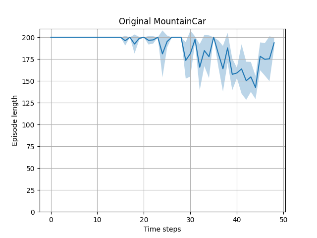
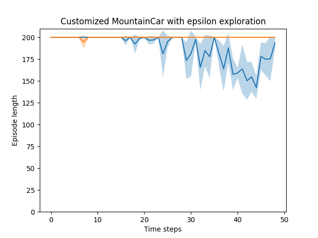
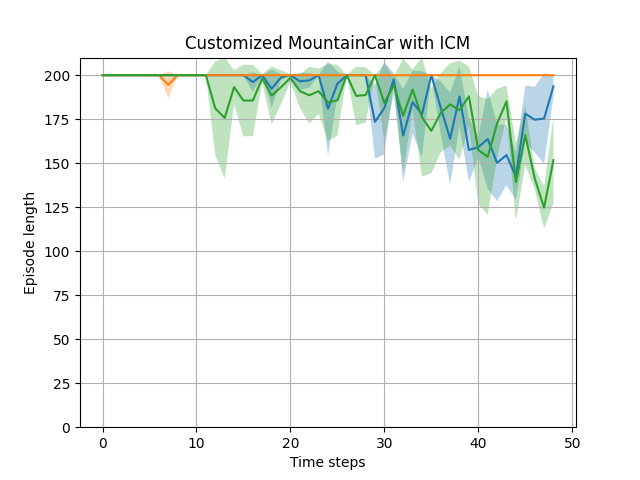
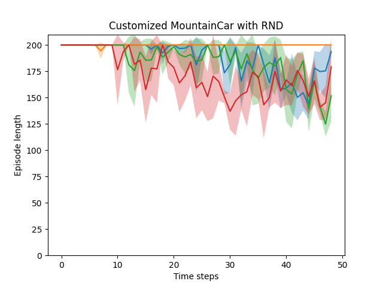

# Sparse-Reward Exploration in RL: RND, ICM & Hindsight Experience Replay

How do you teach an agent to explore when the environment gives it almost no feedback at all?

This project implements and compares three different answers to that question on a sparsified version of **MountainCar**: two *intrinsic motivation* methods - **Random Network Distillation (RND)** and the **Intrinsic Curiosity Module (ICM)** - and **Hindsight Experience Replay (HER)**, which tackles the problem from a completely different angle: not better exploration, but better use of the failures the agent already has.

## The problem

Standard MountainCar gives the agent a reward of `-1` on every single step. That's dense enough to act as a built-in compass: any policy that finishes faster gets a better score, so the agent always has a gradient to climb.

This project replaces that with a much harsher signal: **0 reward on every step, and +200 only if the car reaches the top of the hill.** With plain ε-greedy exploration, the car essentially never reaches the goal by chance within 200 steps, so the agent never observes a non-zero reward - and without that signal, there is nothing to learn from.

```
Dense:   -1, -1, -1, -1, -1, ..., -1        →  always informative
Sparse:   0,  0,  0,  0,  0, ..., 200/0     →  zero signal until you get lucky
```

That gap is the entire reason this project exists.

## Methods

| Method | Idea | Where the new reward comes from |
|---|---|---|
| **RND** | Train a network to predict the output of a second, frozen, randomly-initialized network on each state. Prediction error is high for novel states, low for familiar ones. | `target(s) vs predictor(s)` error |
| **ICM** | Learn a feature space where a model can predict the *next* state from the *current* state + action, trained so the features only capture what the agent's actions can actually influence. | Forward-model prediction error |
| **HER** | Reuse every failed trajectory by pretending, after the fact, that the states the agent *did* reach were the goal all along. Doesn't explore better - squeezes more signal out of existing experience. | Reward relabeling, no new network |

RND and ICM are implemented in [`src/exploration.py`](src/exploration.py) as pluggable intrinsic reward modules that get added on top of the extrinsic DQN reward (see [`src/dqn.py`](src/dqn.py)). HER is implemented as a separate goal-conditioned DQN agent in [`src/her_mountaincar.py`](src/her_mountaincar.py), since it needs the Q-network itself to take the goal as input.

## Results

**Baseline - dense reward, no exploration tricks needed:**



With the original `-1`-per-step reward, vanilla DQN solves the task reliably. This is the reference point: it shows the task itself isn't hard - the *sparsity* is.

**The sparse environment, three exploration strategies:**

| ε-greedy only | ICM | RND |
|---|---|---|
|  |  |  |
| Flatlines at 200 steps - never solves it | Starts improving around step 10k–15k | Starts improving around step 8k–10k |

ε-greedy alone never gets off the ground: with a sparse reward there's no signal to bootstrap from, so the policy stays essentially random for the entire run. Both RND and ICM break through this wall by rewarding the agent for visiting novel states, independent of the task reward - and that's enough to eventually stumble onto the real goal and start learning from it.

**RND converges faster and more consistently than ICM** across runs. That tracks with the intuition behind the two methods: RND's novelty signal comes from a fixed, random target network, so it's simple and stable by construction. ICM's novelty signal depends on how well its forward-dynamics model has learned so far, which adds an extra moving part and, with it, extra variance.

### HER: a different kind of fix

HER doesn't change how the agent explores - it changes how much it learns from each attempt, by relabeling failed trajectories as successes toward goals the agent *did* reach.

| Episode | Success rate | Episode | Success rate |
|---|---|---|---|
| 100–500 | 0% | 1500 | 94% |
| 700 | 13% | 2000 | **99%** (peak) |
| 900 | 58% | 2500 | 97% |
| 1200 | 72% | 3000 | 85% |

Full log: [`results/logs/her_training_log.csv`](results/logs/her_training_log.csv)

Two adaptations were needed to bring HER (originally designed for discrete bit-flipping tasks) to MountainCar's continuous state space:

- **Distance-based goal matching** - a continuous state will essentially never *exactly* equal a goal, so success is defined as being within `GOAL_THRESHOLD = 0.1` of it instead.
- **Unified reward scale** - both real and hindsight goals use the same `0 / 200` scale as the sparse environment, so the Q-network isn't fed two different reward magnitudes.

HER takes far longer to converge than RND or ICM (thousands of episodes vs. ~10k timesteps) because it's still relying on ε-greedy to find anything worth relabeling in the first place - it's not an exploration method. The slight drop after episode 2000 is consistent with ε decaying to the point where the agent starts exploiting a policy that still has a few weak spots, combined with the 500k-capacity replay buffer beginning to discard old transitions.

## Takeaways

- **RND ≈ ICM > HER** in terms of *time to first solve* - because RND/ICM directly target the exploration problem, while HER only helps once the agent has already stumbled onto something useful.
- **HER's strength is sample efficiency, not exploration.** It's the right tool when generating experience is expensive but exploration is comparatively easy - the opposite situation from this task.
- **RND's simplicity is its main advantage over ICM.** A frozen random network is a remarkably effective and low-maintenance novelty detector, which is consistent with the original RND paper's emphasis on robustness over architectural cleverness.
- HER's success here is partly a property of MountainCar's low-dimensional state space (position + velocity). In higher-dimensional environments, hindsight goals sampled from visited states would likely be far less representative, and HER without a real exploration mechanism would probably stall.

## Project structure

```
.
├── src/
│   ├── env.py                # MountainCarSparse: the sparse-reward wrapper
│   ├── exploration.py        # RND and ICM intrinsic reward modules
│   ├── dqn.py                # DQN agent + experiment runner (baseline / ε-greedy / ICM / RND)
│   └── her_mountaincar.py    # Goal-conditioned DQN + HER
├── results/
│   ├── figures/              # Training curves (mean ± std over 3 runs)
│   └── logs/                 # Raw training logs (HER CSV, pickled run arrays)
└── requirements.txt
```

## Getting started

```bash
git clone https://github.com/K4NG14/Sparse-Reward-Exploration.git
cd Sparse-Reward-Exploration
pip install -r requirements.txt

cd src
python dqn.py              # runs baseline, ε-greedy, ICM and RND experiments
python her_mountaincar.py  # trains the goal-conditioned HER agent
```

Each experiment in `dqn.py` runs 3 independent seeds and saves a mean ± std plot to `results/figures/`. `her_mountaincar.py` logs progress every 100 episodes to `results/logs/her_training_log.csv`.

## References

- Y. Burda, H. Edwards, A. Storkey, and O. Klimov, “Exploration by random network distillation,” in International Conference on Learning Representations, 2019. [Online]. Available: https://openreview.net/forum?id=H1lJJnR5Ym

- D. Pathak, P. Agrawal, A. A. Efros, and T. Darrell, “Curiosity-driven exploration by self-supervised prediction,” in Proceedings of the 34th International Conference on Machine Learning - Volume 70, ser. ICML’17. JMLR.org, 2017, p. 2778–2787. [Online]. Available: https://pathak22.github.io/noreward-rl/resources/icml17.pd


- M. Andrychowicz, F. Wolski, A. Ray, J. Schneider, R. Fong, P. Welinder, B. McGrew, J. Tobin, P. Abbeel, and W. Zaremba, “Hindsight experience replay,” in 31st Conference on
Neural Information Processing Systems (NIPS 2017), 2017, pp. 5048–5058. [Online]. Available: https://arxiv.org/pdf/1707.01495.pdf

Built on [Gymnasium](https://gymnasium.farama.org/)'s `MountainCar-v0` and PyTorch.
